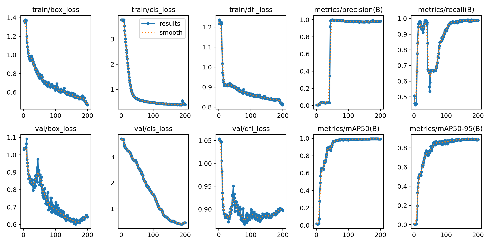
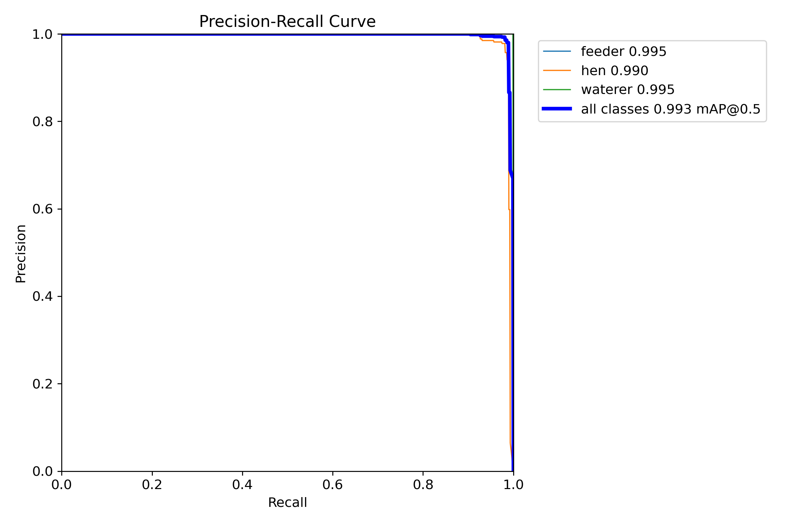
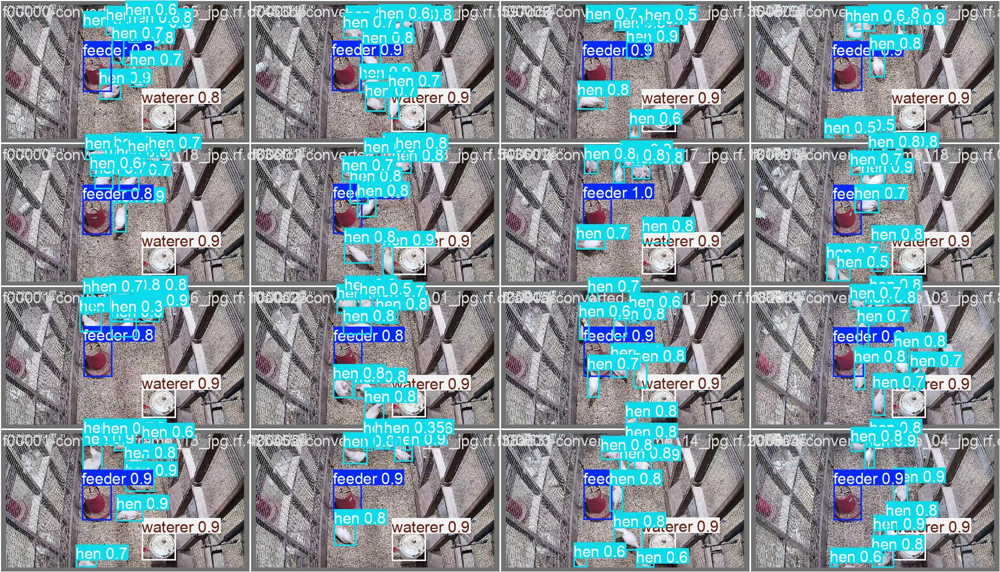

# Poultry Vision Project

This repository contains a YOLOv12-based model for detecting and tracking poultry in a cage-free environment. The model is trained to identify hens, feeders, and waterers to support automated monitoring.

The ultimate goal of this research is to implement and extend automated detection of key behavioral phenotypes, such as feeding and drinking, to assess animal welfare and thermotolerance, as outlined in the [accompanying research paper](https://www.mdpi.com/2077-0472/15/18/1963).

## Model: `poultry-yolo12n-v1`

The current model is a YOLOv12n variant trained on a custom dataset of poultry images.

## Sample Inference

Below is a sample inference video demonstrating the model's detection and tracking capabilities on poultry behavior:


The model successfully detects and tracks:
- **Hens** with real-time behavior classification (Feeding, Drinking, Idle)
- **Feeders** and **Waterers** as resource zones
- Individual hen tracking with cumulative time spent feeding and drinking

### Training Results
Here are the key performance metrics from the `poultry_yolo12n_run1` training run:

| Overall Results | Confusion Matrix |
| :---: | :---: |
|  |  |

| PR Curve | Validation Prediction |
| :---: | :---: |
|  |  |

---

## Setup & Installation

This project is built on a forked version of YOLOv12. To set up the environment, follow these steps:

1.  **Clone the Repository:**
    ```bash
    git clone [https://github.com/ogbidaniel/yolov12.git](https://github.com/ogbidaniel/yolov12.git)
    cd yolov12
    ```

2.  **Create Conda Environment:**
    ```bash
    # Create a new environment
    conda create --name poultry-vision python=3.12

    # Activate the environment
    conda activate poultry-vision
    ```

3.  **Install Dependencies:**
    ```bash
    # 1. Install all required packages
    pip install -r requirements.txt

    # 2. Install this local ultralytics fork in editable mode
    pip install -e .
    ```

---

## How to Run Inference

The `main.py` script runs real-time inference with behavior tracking on video input. The model displays detection results in a popup window.

### Prerequisites
1. Place your trained `.pt` model file in the `models/` directory
2. Ensure you have sample videos in the `samplevideos/` directory

### Running Inference

To run inference on a video:

```bash
python main.py
```

### Customizing Inference

To use your own model or video, edit the configuration paths in `main.py`:

```python
# --- CONFIGURATION ---
MODEL_PATH = "models/your-model-name.pt"  # Update to your model path
VIDEO_PATH = "samplevideos/your-video.mp4"  # Update to your video path
```

**Class Map**: If your model has different classes, update the `CLASS_MAP` dictionary:

```python
CLASS_MAP = {
    0: 'class_name_1',   
    1: 'class_name_2',   
    2: 'class_name_3'   
}
```

### Controls
- Press **'q'** in the video window to stop inference and exit
- The script displays real-time detection with behavior tracking overlays
- No output is saved by default (results are only displayed)